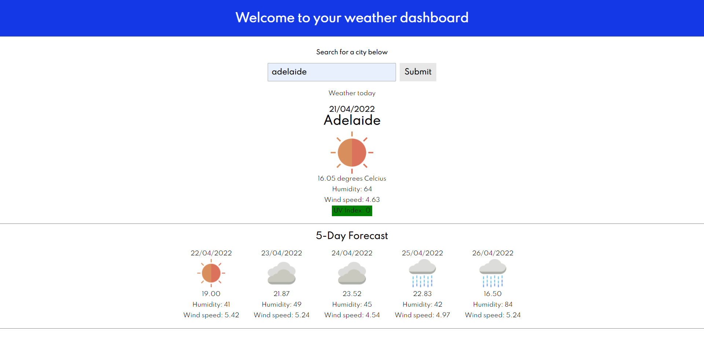

# weather-dashboard

For this project, I needed to create a weather dashboard that populates based in data gathered from a web API.

- When the user searches for a city, they are presented with current and future conditions for that city.
- They are able to view the UV index which is coloured based on the severity.
- further down on the page the user is presented with a 5 day forecast which displays the date, an icon which represents the weather conditions, temperature and humidity.

Below is a screenshot  and a link to the deployed application:

Application link: https://gkal14.github.io/weather-dashboard/